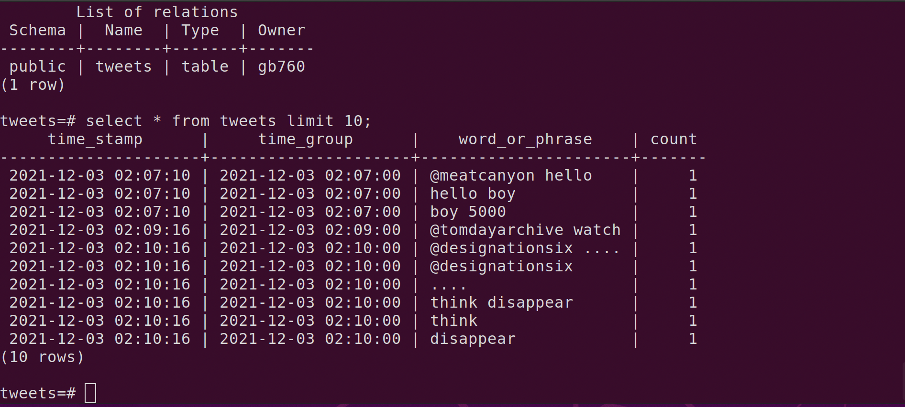

# Twitter-Trendiness-Score-Analysis (GB-760-Project)

*This project was conducted by Calvin Chen, Daniel Hom, Duc Le, Lucius Liu, Vitchuda Poonyakanok, and Yuyang Xie in University of Wisconsin-Madison, Wisconsin School of Business in 2021*

## Intro
This project is about to build system to continuously read tweets from Twitter API to database and Kafka and scored phrases and words based on Twitter trends each minutes using Python and PostgreSQL


Watch our *[Demo Video!](https://www.youtube.com/watch?v=RsZ3ixB_C6Q)

## Milestone 1

* [**server.py**](Milestone1/server.py) - Read tweets from the Twitter API and write tweets to a .txt file

* [**word_count.py**](Milestone1/word_count.py) - Compute frequencies of words and phrases
```
python3 word_count.py -w -"input your word or phrase"
```

* [**vocabulary_size.py**](Milestone1/vocabulary_size.py) - Compute the number of unique words
```
python3 vocabulary_size.py
```

## Milestone 2

For this milestone, we will continue read tweets from the Twitter API and write them to the database using python.

* [**schema_postgres.sql**](Milestone2/schema_postgres.sql) - Design a data warehouse to store infromation required to comput the most current trendiness score. Construct the tables under this schema. 
* [**server_postgres.py**](Milestone2/server_postgres.py) - Read tweets from the Twitter API and write tweets to a PostgreSQL database.



* [**word_count_postgres.py**](Milestone2/word_count_postgres.py) - Compute frequencies of words and phrases
```
python3 word_count_postgres.py -w -"input your word or phrase"
```
* [**vocabulary_size_postgres.py**](Milestone2/vocabulary_size_postgres.py) - Compute the number of unique words
* [**trendiness_postgres.py**](Milestone2/trendiness_postgres.py) - Compute the trendiness score
```
python3 trendiness_postgres.py -w -"input your word or phrase"
```

## Milestone 3

For this milestone, we will continue read tweets from the Twitter API and write them to the Kafka using python.

 * sudo `systemctl start kafka` -> `sudo systemctl status kafka` (Turn on the Kafka and check)
  * Create Topics in your terminal: `~/kafka/bin/kafka-topics.sh --create --topic gb760 --bootstrap-server localhost:9092 --partitions 1 --replication-factor 1`
  * Run [**server_to_kafka.py**](Milestone3/server_to_kafka.py) - Create producers to read the tweets from the twitter Api and read the tweets to kafka
  * Run [**server_from_kafka.py**](Milestone3/server_from_kafka.py) - Create consumers and use Psycoph to connect database
  * Run [**trendiness_socre_kafka.py**](Milestone3/trendness_score_kafka.py) - As long as this code runs, at each new minute, it should print the most up-to-date trendiness score
  
  ```
  python3 trendiness_kafka.py -w -"input your word or phrase"
  ```

